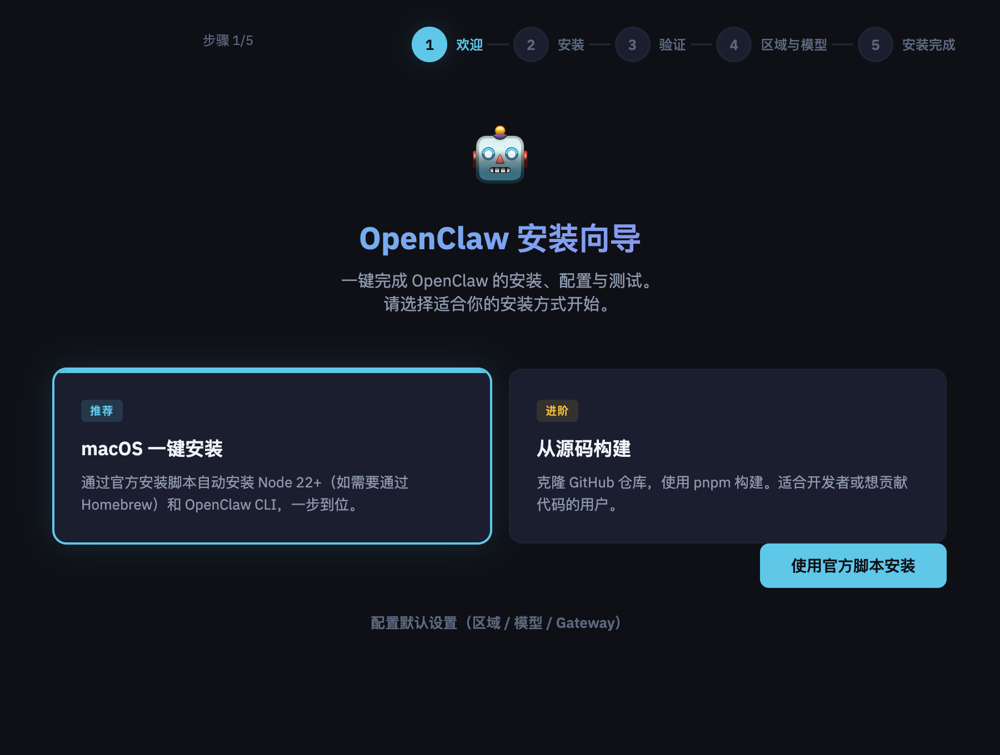
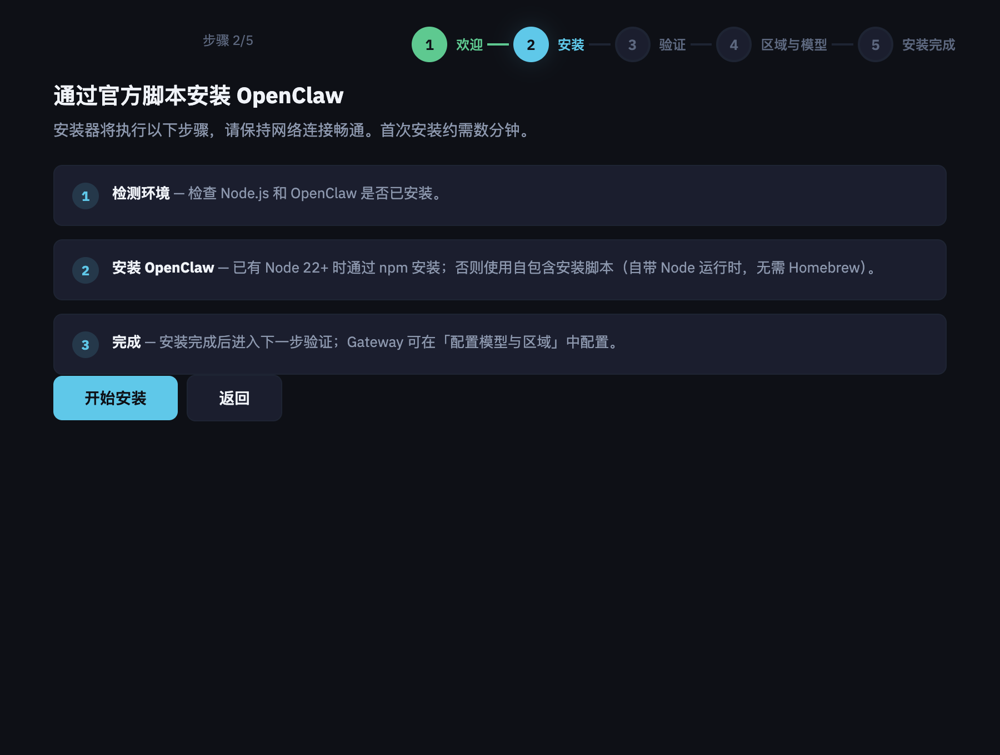
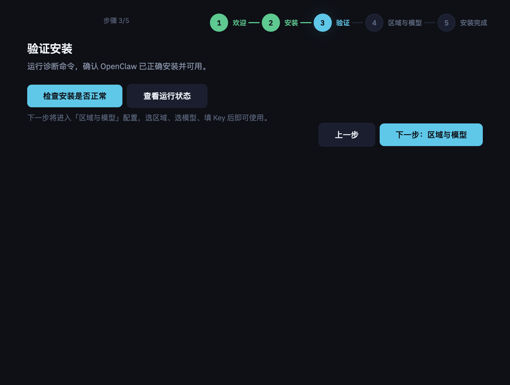
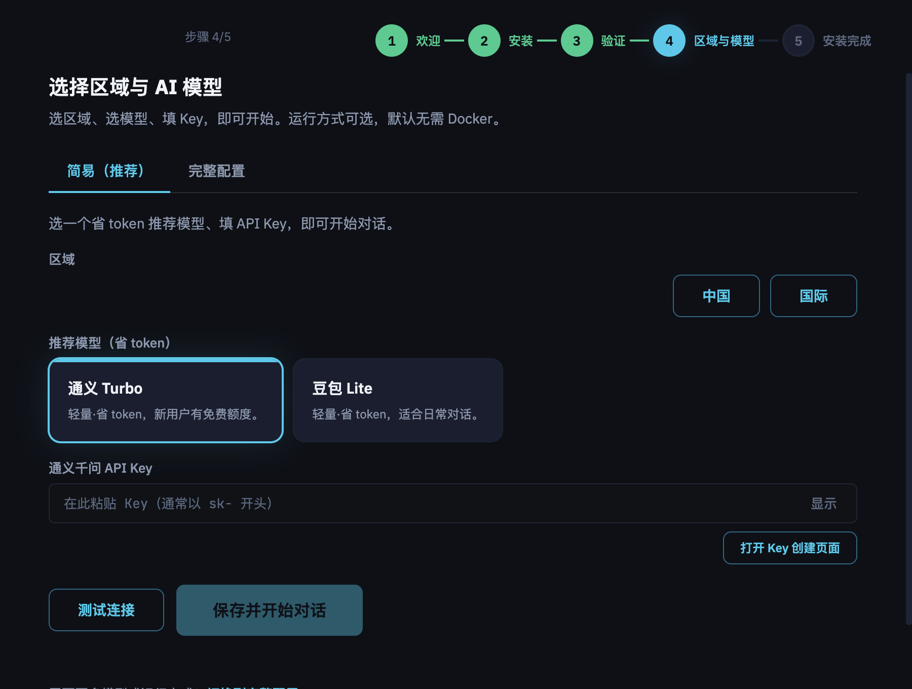
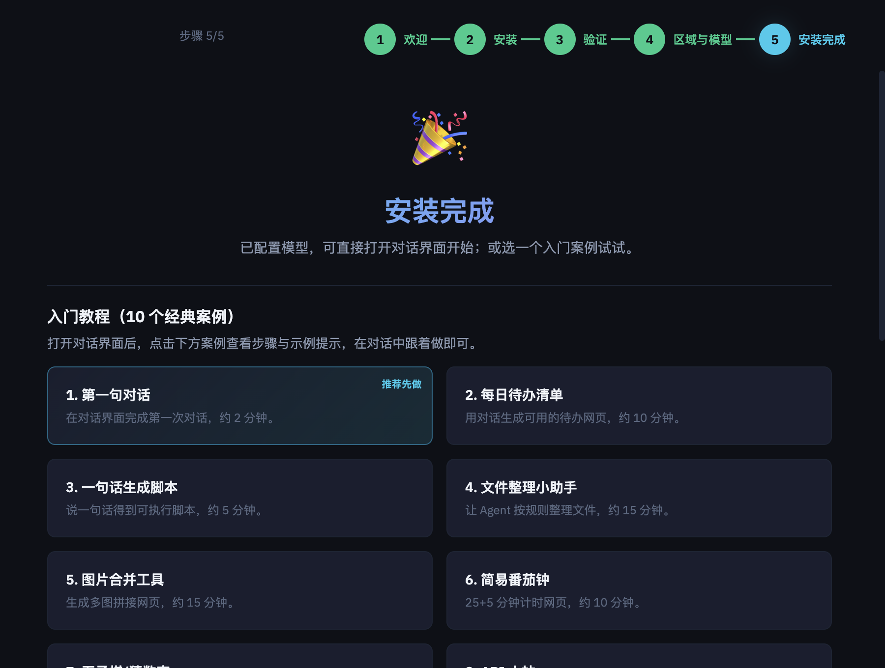
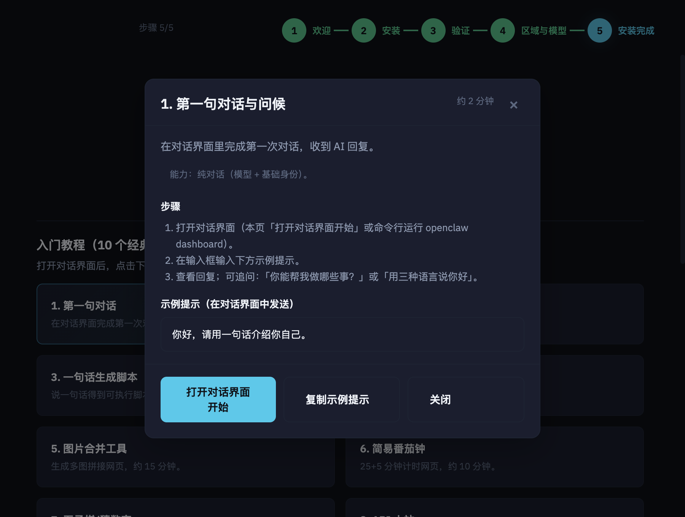

# OpenClaw UI Installer Mac Installation Guide

Install, verify, and configure OpenClaw on your Mac using the graphical installer—no command-line experience required.

*[中文版](README-MAC.md)*

---

## System requirements

- **macOS**: 10.13 or later (Intel and Apple Silicon)
- **Network**: Keep a stable connection during install and configuration
- **Sandbox (optional)**: For “Safe” or “Daily” run modes, install and start [Docker Desktop](https://www.docker.com/products/docker-desktop/) first

---

## Download the installer

Get the **macOS installer** (DMG) from one of the links below. Open the DMG and drag “OpenClaw Installer” into **Applications**.

- **GitHub Releases**: [OpenClaw Installer Releases](https://github.com/openclaw-ai/openclaw/releases) (choose the DMG labeled `macOS` or `Installer`)
- **Official install page**: [openclaw.ai](https://openclaw.ai) or [Install overview](https://docs.openclaw.ai/install)

---

## Install steps overview

The installer has **5 steps**: Welcome → Install → Verify → Region & Model → Finish. Each step is described below with a screenshot.

---

### Step 1 of 5: Welcome — Choose install method

On the welcome screen, pick one install method:

| Option | Description |
|--------|-------------|
| **macOS one-click install (recommended)** | Uses the official script to install Node 22+ and OpenClaw CLI automatically; no Homebrew required. |
| **Build from source** | Clone the repo and build with pnpm. For developers or contributors. |

After choosing “macOS one-click install”, click **“Install via official script”** to continue.

---

### Step 2 of 5: Install — Run the install script

This step runs:

1. **Environment check**: Detects Node.js and OpenClaw (if already installed).
2. **Install OpenClaw**: Uses npm when Node 22+ is present; otherwise uses a self-contained script (no Homebrew).
3. **Done**: Proceeds to “Verify”; Gateway can be configured later in “Region & Model”.

Keep your network connected; the first install usually takes a few minutes. Click **“Start install”**, then wait for the log to show completion.

---

### Step 3 of 5: Verify — Confirm install

The verify step checks that OpenClaw is installed and working:

- Click **“Check if installation is normal”**: Runs the doctor command and shows the output.
- Optionally **“View running status”**: Shows current service status.

If there are no errors, click **“Next: Region & Model”** to go to configuration.

---

### Step 4 of 5: Region & Model — Choose region, model, and API Key

You must complete this step before you can start a conversation:

1. **Region**: **China** or **International**.
2. **Recommended model**: Pick a token-efficient model (e.g. Qwen Turbo, Doubao Lite); each card has a short note (e.g. free tier, use case).
3. **API Key**: Paste the model’s API Key in the field (use “Open Key creation page” to get one).
4. **Test and save**: Optionally click **“Test connection”**, then **“Save and start conversation”** to apply.

Run mode (direct / sandbox) is under the **“Full configuration”** tab; default is “Direct run” and does not need Docker.

---

### Step 5 of 5: Finish — Open conversation or try tutorials

After configuration you see the finish page:

- **Open conversation**: Click the main button **“Open conversation and start”**. The installer starts the connection service and opens the browser.
- **Tutorials**: The page lists “Getting started (10 classic cases)”. After opening the conversation UI, click any case for steps and example prompts.

We recommend doing “1. First message” before the others.

---

### Tutorial popup example

Clicking a tutorial case opens a popup with **goal**, **steps**, and **example prompt**. Use “Copy example prompt” in the conversation, or “Open conversation and start” to begin.

---

## After install

| Need | Action |
|------|--------|
| **Change model or region** | Menu **“Region & model config”**, or on the finish page “Configure model & region” → choose model, enter Key → **“Apply config”**. |
| **Update OpenClaw** | Menu **“Management console”** → **“Update OpenClaw”**. |
| **View / start / stop connection service** | Finish page shows Gateway status; use the management console to start, stop, or restart. |
| **Uninstall** | Menu **“Uninstall OpenClaw”** and follow the prompts. |

See also [Updating OpenClaw and config](docs/UPDATING-OPENCLAW-AND-CONFIG.md).

---

## FAQ

- **Connection service not running**: On the finish page click “Start connection service”, or run in Terminal: `openclaw gateway --port 18789`.
- **Docker not installed or not running**: If you chose sandbox mode, install and start Docker Desktop (Launchpad → Docker). Then on the config page click “Retry apply config”, or switch to “Direct run” and apply again.
- **API Key verification failed**: Ensure the Key is complete (no extra spaces), not expired, and matches the selected provider. For Doubao/Volcengine, enable the model in the [Ark console](https://console.volcengine.com/ark/region:ark+cn-beijing).
- **Doubao 404**: If Ark only has 1.5 and the installer uses Seed 2.0 by default, enable Seed 2.0 in the Ark console or pick another enabled model.

---

## Privacy and data

- **Conversations and config stay on your machine**; they are not uploaded to the cloud.
- **API Keys** are stored only in your local OpenClaw config directory (e.g. `~/.openclaw`) and used only by this app.

---

## More docs

- [Install overview](https://docs.openclaw.ai/install)
- [Quick start](https://docs.openclaw.ai/start/getting-started)
- [Sandbox](https://docs.openclaw.ai/gateway/sandboxing)
- [Model providers and API keys](https://docs.openclaw.ai/providers/models)

